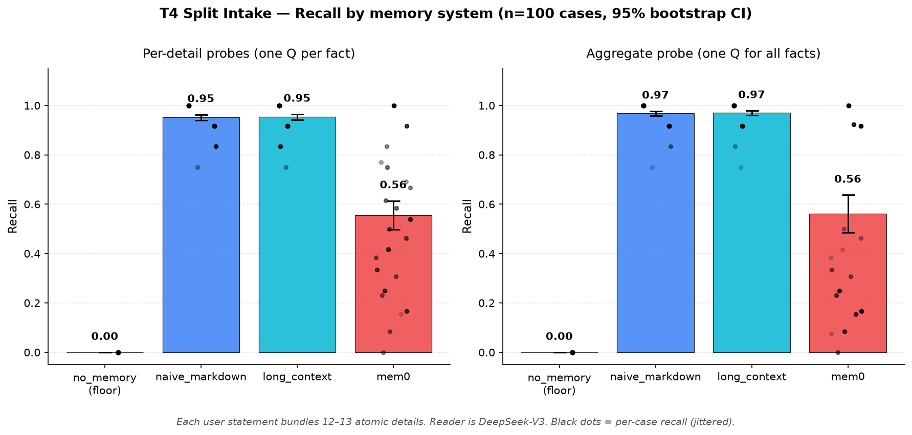

# Agent Memory Benchmark

A benchmark for evaluating LLM memory systems in **multi-agent shared-memory** scenarios.

## The question this exists to answer

In 2026, MCP, A2A, and shared-memory products are pushing toward a world where **multiple LLM agents (Claude, ChatGPT, Codex, custom agents) work off the same memory layer**. Every major memory benchmark today (LongMemEval, LoCoMo, MemoryBank, HaluMem, GateMem) still assumes a single agent reads and writes its own memory.

This benchmark fills the gap: **when N agents share one memory store, do existing memory systems hold up?**

## Status

The project now has two complementary benchmark tracks. They answer different
product questions and should not be collapsed into one score.

| Track | Task | Systems | Status |
|---|---|---|---|
| Factual memory | **T4 — split intake** | no_memory, naive_markdown, pure_vector, AMH, mem0 | ✅ n=300, [final writeup](./docs/v1/t4_findings.md) |
| Factual memory | **T2 — compound update** | no_memory, naive_markdown, pure_vector, AMH, mem0 | ✅ corrected n=298 five-system result, [final writeup](./docs/v1/t2_findings.md) |
| User preference memory | **Preference pilot** | naive_markdown, AMH, mem0 | ✅ n=30 one-run pilot, [findings](./docs/v1/preference_pilot_n30_once_findings.md) |

T4 tests whether detailed factual information survives a multi-agent memory
pipeline. T2 tests multi-fact updates and collateral damage. The Preference
Track tests whether stable preferences can be merged across agents, updated,
kept separate from temporary requirements, and used in a decision. See
[`docs/v1/`](./docs/v1/README.md) for the designs and limitations.



An initial atomic-level pass (v0) is in the git history. It tested one-fact-per-memory + explicit-style updates and concluded that **atomic tasks don't discriminate memory systems** — modern LLMs reason out trivial updates from raw context, so a 30-line markdown baseline scores 100% and no headline finding emerges. The v0 scaffolding (agent client, runner, judge, mem0 adapter, baseline systems) is reused by v1; the v0 conclusions are not.

## Repo layout

```
src/
  agent.py             # DeepSeek client (used everywhere)
  judge.py             # programmatic scoring
  runner.py            # orchestrates write → read → judge per case
  systems/             # memory system adapters (one file per system)
  cases/               # task / case generators
scripts/               # CLI entrypoints
data/
  cases/               # generated case JSONs (committed for reproducibility)
  results/             # published production results + ignored local runs
docs/
  v1/                  # active task spec
  decisions.md         # frozen design choices + setup gotchas
  roadmap.md           # done / now / next
  workflow.md          # how this repo makes changes
models/                # locally-vendored embedding model (git-ignored, see decisions.md)
```

## Setup

```bash
# 1. Python 3.11+ (system 3.9 will not work — SSL + syntax incompatibilities)
brew install python@3.11

# 2. Clone and virtualenv
git clone https://github.com/Gloria-Qi0311/agent-memory-benchmark.git
cd agent-memory-benchmark
python3.11 -m venv .venv && source .venv/bin/activate

# 3. Dependencies
pip install -r requirements.txt

# 4. API key
cp .env.example .env
# put your DEEPSEEK_API_KEY in .env

# 5. Embedding model — see docs/decisions.md for why this is manual
mkdir -p models/multi-qa-MiniLM-L6-cos-v1/1_Pooling
cd models/multi-qa-MiniLM-L6-cos-v1
BASE="https://hf-mirror.com/sentence-transformers/multi-qa-MiniLM-L6-cos-v1/resolve/main"
for f in config.json config_sentence_transformers.json modules.json \
         sentence_bert_config.json special_tokens_map.json tokenizer.json \
         tokenizer_config.json vocab.txt model.safetensors; do
  curl -L -o "$f" "$BASE/$f"
done
curl -L -o 1_Pooling/config.json "$BASE/1_Pooling/config.json"
cd ../..
```

## Stack

- **Agent + judge LLM**: DeepSeek-V3 (cost + capability fit). Programmatic judging wherever possible; LLM-as-judge only as fallback.
- **Factual-track systems**: `no_memory`, `naive_markdown`, `pure_vector`, `AMH`, and `mem0`.
- **Preference-track systems**: `naive_markdown`, `AMH`, and `mem0`. `no_memory` and `pure_vector` are intentionally not part of this product comparison.
- **mem0 backend**: DeepSeek for its internal LLM, sentence-transformers (`multi-qa-MiniLM-L6-cos-v1`) for embeddings, qdrant in embedded mode.
- **Python**: 3.11+ required.

## Known limitations (v1 design)

- **Self-evaluation bias.** The DeepSeek agent and any LLM-judged subtask share the same model. Programmatic judging covers most of it.
- **Single LLM, single vendor.** Cross-vendor evaluation (Claude + GPT + Llama) is parking-lot.
- **Multi-agent is simulated.** Different writer agent IDs feed the same memory store; this captures cross-agent write/read flow, not autonomous agents with independent planning.
- **Preference pilot size.** The n=30 run is useful for validating the benchmark and exposing failure cases, but it is not large enough for a definitive market ranking.

See [`docs/v1/README.md`](./docs/v1/README.md) for the active benchmark design.
